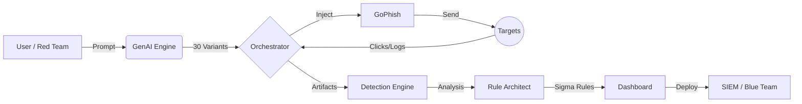

# PhishTrek: Offensive-to-Defensive Cyber Resilience Platform

**PhishTrek** is an advanced engineering platform designed to bridge the gap between **Red Teaming** (Simulation) and **Blue Teaming** (Defense). Unlike traditional phishing simulators, PhishTrek uses Generative AI to create polymorphic attacks, tests them against real defenses, and **automatically engineers detection rules (Sigma)** to close security gaps.

> **Master's Engineering Project (PFE)** - ESME
> *Developed by Mouad BENTEFRIT & Sofiane BENNEDJIMA*

-----

## 🚀 Key Features

### 🧠 1. GenAI Content Engine (Offensive)

- **Polymorphic Attacks:** Generate 30+ unique email variants from a single prompt using OpenAI (GPT-4) or Ollama (Local).
- **Context-Aware:** Inject specific personas (e.g., "Finance Manager"), tones (Urgent, Authoritative), and contexts.
- **Safety Guardrails:** Automatic sanitization of generated content to prevent misuse.

### 🛡️ 2. Automated Defense Testing (Defensive)

- **Pre-Flight Checks:** Analyze landing pages against **VirusTotal** API (70+ vendors) before launch.
- **Stylometry Analysis:** Detect "AI-written" patterns in emails using NLP to anticipate defensive blocking.
- **Header Analysis:** Simulate SPF/DKIM/DMARC checks.

### ⚙️ 3. Industrial Orchestration

- **GoPhish Wrapper:** Fully automated integration with GoPhish via API (no manual campaign creation).
- **Batch Processing:** Handle complex 1-to-N campaign mappings (1 Logic Campaign = 30 Technical Variants).
- **Smart Polling:** Real-time tracking of Opens, Clicks, and Submissions.

### 📝 4. Auto-Remediation (The "Crown Jewel")

- **Sigma Rule Generator:** Automatically converts attack patterns (Logs) into **Sigma Rules**.
- **Multi-SIEM Export:** Deploy rules instantly to Splunk, Elastic, or Microsoft Sentinel.
- **Feedback Loop:** The system learns from successful evasions to propose stronger rules.

-----

## 📚 Technical Documentation (Modules)

The platform architecture is divided into **6 sequential modules**. Click below for detailed engineering specs and sequence diagrams:

| Phase | Module | Description |
| :--- | :--- | :--- |
| **01** | [**Authentication & Validation**](https://www.google.com/search?q=docs/readme/01_authentication_domain_validation_system.md) | Zero-trust access, professional domain validation (DNS/Whois). |
| **02** | [**GenAI Content Engine**](https://www.google.com/search?q=docs/readme/02_genai_content_engine.md) | Prompt engineering, JSON validation, and template generation. |
| **03** | [**Campaign Orchestration**](https://www.google.com/search?q=docs/readme/03_gophish_campaign_orchestration.md) | GoPhish API wrapper, batch injection, and event tracking. |
| **04** | [**Detection Pipeline**](https://www.google.com/search?q=docs/readme/04_detection_analysis_pipeline.md) | VirusTotal integration, heuristics, and NLP analysis. |
| **05** | [**Sigma Rule Engineering**](https://www.google.com/search?q=docs/readme/05_automated_sigma_rule_generation.md) | **Core Innovation.** Clustering logs to generate valid Sigma YAML. |
| **06** | [**KPI Dashboard**](https://www.google.com/search?q=docs/readme/06_kpi_dashboard_reporting.md) | CISO analytics, Phish-Prone Percentage, and PDF reporting. |

-----

## 🏗️ Architecture Overview

The system follows a continuous feedback loop: **Attack $\rightarrow$ Analyze $\rightarrow$ Protect**.



*(See [architecture.md](https://www.google.com/search?q=docs/architecture.md) for the high-level sequence diagram)*

-----

## 🛠️ Tech Stack

* **Backend:** Python 3.11, **FastAPI** (Async API), **Celery** (Background Jobs).
* **Frontend:** Modular JavaScript (ES6+), **Chart.js**, Tailwind CSS.
* **Core Engine:** **GoPhish** (Campaigns), **Ollama/OpenAI** (LLM), **VirusTotal** (Intel).
* **Data & Infra:** PostgreSQL, Redis (Caching), Docker & Docker Compose.

-----

## ⚡ Quick Start

### Prerequisites

* Docker & Docker Compose
* OpenAI API Key (Optional, can use Ollama)
* VirusTotal API Key (Free tier works)

### Installation

1.  **Clone the repository:**

    ```bash
    git clone https://github.com/Mouad033/PhishTrek.git
    cd PhishTrek
    ```

2.  **Configure Environment:**
    Copy the example env file and fill in your keys.

    ```bash
    cp .env.example .env
    # Edit .env to add GOPHISH_API_KEY and API keys
    ```

3.  **Launch with Docker:**

    ```bash
    docker-compose up -d --build
    ```

4.  **Access the Platform:**

    * **PhishTrek Dashboard:** `http://localhost:8000` (or configured port)
    * **GoPhish Admin:** `https://localhost:3333`
    * **API Docs (Swagger):** `http://localhost:8000/docs`

-----

## ⚖️ Ethical & Legal Disclaimer

**PhishTrek is a defensive security tool.**

* **Authorization:** Only use this tool on systems you own or have explicit written permission to test.
* **No Harm:** The AI engine includes safety filters to prevent the generation of actual malware or harmful payloads.
* **Responsibility:** The authors are not responsible for any misuse of this software. It is intended for educational purposes and authorized security testing (Red/Blue Teaming) only.

-----

## 👥 Authors

**ESME Engineering School - Class of 2025**

* **Mouad BENTEFRIT**
* **Sofiane BENNEDJIMA** 

-----

*Made with ❤️ for better Cyber Resilience.*