# PhishTrek - Complete Workflow

## Comprehensive Platform Overview

```mermaid
sequenceDiagram
    actor RedTeam as Red Team Lead<br/>(Attacker Simulator)
    actor SOC as Blue Team / CISO<br/>(Defender)
    participant Platform as PhishTrek Platform<br/>(Orchestration Center)
    participant DB as Data Storage<br/>(Campaign Records)
    participant External as External Services<br/>(GoPhish, VirusTotal, SIEM)
    participant Dashboard as Analytics Dashboard<br/>(Metrics & Insights)

    Note over RedTeam,Dashboard: 🌐 PHISTREK GLOBAL WORKFLOW (Complete Cycle)

    Note over RedTeam,Dashboard: ═══════════════════════════════════════════════════════
    Note over RedTeam,Dashboard: 1️⃣ PHASE 1: PROFESSIONAL AUTHENTICATION & DOMAIN VALIDATION
    Note over RedTeam,Dashboard: ═══════════════════════════════════════════════════════

    RedTeam->>Platform: 1. Sign Up<br/>Email: user@acme.com<br/>Company: Acme Corp

    Platform->>Platform: Check domain is professional<br/>(not gmail.com, outlook.com, etc.)

    Platform->>Platform: Verify domain authenticity<br/>├─ DNS records (MX, SPF)<br/>├─ Company registration<br/>└─ Domain age & reputation

    Platform->>RedTeam: Send verification email + 2FA code

    RedTeam->>Platform: 2. Verify email & enter 2FA code

    Platform->>DB: Account created & verified<br/>Status: ✅ Professional user
    DB-->>Platform: User ID: 42

    Platform-->>RedTeam: ✅ WELCOME TO PHISTREK<br/>You're now authenticated<br/>Ready to create security campaigns

    Note over RedTeam,Dashboard: ═══════════════════════════════════════════════════════
    Note over RedTeam,Dashboard: 2️⃣ PHASE 2: OFFENSIVE CAMPAIGN GENERATION
    Note over RedTeam,Dashboard: ═══════════════════════════════════════════════════════

    RedTeam->>Platform: 3. Create New Campaign<br/>├─ Target Persona: Finance Manager<br/>├─ Target Domain: acme.com<br/>├─ Attack Type: Credential Theft<br/>├─ Email Variants: 30<br/>└─ Recipients: 50 employees

    Platform->>Platform: Generate realistic phishing emails<br/>using AI/LLM<br/>├─ Subject lines (urgency, authority)<br/>├─ Email bodies (personalized)<br/>├─ Landing page (credential form)<br/>└─ Tracking mechanism (pixel + URL)

    Platform->>External: 4. Pre-Flight Security Check<br/>Submit landing page URL<br/>to VirusTotal for scanning

    External->>External: Analyze URL for malicious indicators<br/>├─ Check against 77 antivirus vendors<br/>├─ Calculate risk score (0-100%)<br/>└─ Return verdict: CLEAN/SUSPICIOUS/MALICIOUS

    External-->>Platform: Verdict: CLEAN (3.25% risk)<br/>✅ URL approved for campaign

    Platform->>Platform: ⏰ DECISION GATE<br/>If verdict = MALICIOUS → BLOCK campaign<br/>If verdict = SUSPICIOUS → ASK analyst<br/>If verdict = CLEAN → PROCEED

    Platform-->>RedTeam: ✅ CAMPAIGN READY FOR LAUNCH<br/>30 email variants prepared<br/>Landing page verified safe<br/>50 targets identified

    Note over RedTeam,Dashboard: ═══════════════════════════════════════════════════════
    Note over RedTeam,Dashboard: 3️⃣ PHASE 3: OFFENSIVE CAMPAIGN EXECUTION
    Note over RedTeam,Dashboard: ═══════════════════════════════════════════════════════

    RedTeam->>Platform: 5. Launch Campaign

    Platform->>External: Execute via GoPhish<br/>├─ Send 1500 emails (30 variants × 50 recipients)<br/>├─ Include tracking pixels (measure opens)<br/>├─ Include unique URLs (measure clicks)<br/>└─ Include credential forms (measure submissions)

    External->>External: Campaign Running (120 minutes)<br/>Email journey:<br/>├─ Emails sent → Recipient inbox<br/>├─ Opens tracked (pixel beacon)<br/>├─ Clicks tracked (unique URL)<br/>└─ Credentials captured (form submission)

    External-->>Platform: Real-time Results<br/>Sent: 1500 ✉️<br/>Opened: 960 (64.6%) 👁️<br/>Clicked: 540 (36.4%) 🖱️<br/>Submitted: 135 (9%) 🔐

    Platform->>DB: Store campaign results<br/>├─ Each user interaction<br/>├─ IP address & geolocation<br/>├─ Device & browser info<br/>└─ Timestamp of each action

    Platform-->>RedTeam: 📊 Campaign Complete<br/>Results available for analysis

    Note over RedTeam,Dashboard: ═══════════════════════════════════════════════════════
    Note over RedTeam,Dashboard: 4️⃣ PHASE 4: DEFENSIVE ANALYSIS (Automated)
    Note over RedTeam,Dashboard: ═══════════════════════════════════════════════════════

    Platform->>Platform: 6. Analyze Email Defenses<br/>Question: What did defenses catch?

    Platform->>Platform: Check each email against<br/>Security Systems:<br/>├─ SIEM Rules (current defense)<br/>├─ Email Gateways (spam filters)<br/>├─ Antivirus/Malware detection<br/>└─ User awareness (manual reporting)

    Platform->>Platform: Generate Detection Report<br/>Results:<br/>├─ 820/1500 emails detected (55%)<br/>├─ 690/1500 emails bypassed (45%)<br/>├─ Detection confidence: 87%<br/>└─ Critical gaps identified

    Platform->>DB: Store detection analysis<br/>├─ Which defenses worked<br/>├─ Which attacks bypassed<br/>├─ Confidence levels<br/>└─ False negatives flagged

    Platform-->>SOC: 📋 Analysis Complete<br/>FINDINGS:<br/>• 820 emails caught by defenses ✅<br/>• 690 emails slipped through ❌<br/>• Biggest weakness: Domain spoofing<br/>• Urgency keywords bypassed filters

    Note over RedTeam,Dashboard: ═══════════════════════════════════════════════════════
    Note over RedTeam,Dashboard: 5️⃣ PHASE 5: AUTOMATED COUNTER-MEASURE GENERATION
    Note over RedTeam,Dashboard: ═══════════════════════════════════════════════════════

    Platform->>Platform: 7. Generate Defense Rules<br/>Analyze what worked in attack:<br/>├─ Email subjects (patterns)<br/>├─ Sender domains (spoofing)<br/>├─ URLs & links (shorteners)<br/>├─ Body content (language markers)<br/>└─ Headers (authentication bypass)

    Platform->>Platform: AI/LLM Generates Detection Rules<br/>Creates 4 Sigma Rules:<br/>├─ Rule 1: Domain Spoofing (95% confidence)<br/>├─ Rule 2: Urgency + URL Shorteners (92%)<br/>├─ Rule 3: Header Manipulation (88%)<br/>└─ Rule 4: AI-Generated Content (78%)

    Platform->>Platform: Validate Rules<br/>✅ Syntax correct<br/>✅ Logic sound<br/>✅ MITRE ATT&CK mapped<br/>✅ False positive risk: 5-15%

    Platform->>Platform: Convert to SIEM formats<br/>Export rules for:<br/>├─ Splunk (SPL queries)<br/>├─ Elastic/ELK (KQL)<br/>├─ Azure Sentinel (KQL)<br/>└─ ArcSight (ESL)

    Platform->>DB: Store generated rules<br/>4 rules ready for<br/>├─ Review by analysts<br/>├─ Testing in SIEM<br/>└─ Deployment to production

    Platform-->>SOC: 📝 Rules Generated<br/>4 detection rules created<br/>├─ Ready for deployment<br/>├─ Expected to catch 390 similar attacks<br/>└─ Minimal false positives (5-15%)

    SOC->>SOC: Review & Approve<br/>✅ All 4 rules approved

    SOC->>External: Deploy rules to SIEM

    External-->>SOC: ✅ Rules now active<br/>Will detect similar attacks<br/>in real-time

    Note over RedTeam,Dashboard: ═══════════════════════════════════════════════════════
    Note over RedTeam,Dashboard: 6️⃣ PHASE 6: ANALYTICS DASHBOARD & CONTINUOUS IMPROVEMENT
    Note over RedTeam,Dashboard: ═══════════════════════════════════════════════════════

    SOC->>Dashboard: 8. Open Campaign Analytics

    Dashboard->>DB: Retrieve all campaign data<br/>├─ Engagement metrics<br/>├─ Detection results<br/>├─ Rule performance<br/>├─ User risk data<br/>└─ System health

    Dashboard->>Dashboard: Build comprehensive view

    Dashboard-->>SOC: 📊 COMPLETE DASHBOARD<br/><br/>CAMPAIGN METRICS:<br/>├─ Engagement Funnel<br/>│  ├─ Sent: 1500 emails<br/>│  ├─ Opened: 960 (64.6%)<br/>│  ├─ Clicked: 540 (36.4%)<br/>│  └─ Submitted: 135 (9%)<br/>├─ Risk Assessment<br/>│  ├─ Phish-prone users: 51%<br/>│  ├─ Risky department: Finance (58%)<br/>│  └─ High-risk users: 10 identified<br/>├─ Detection Performance<br/>│  ├─ Overall detection: 74%<br/>│  ├─ False negatives: 26%<br/>│  └─ Defense gaps: Domain spoofing<br/>├─ Rules Generated<br/>│  ├─ Rules created: 4<br/>│  ├─ Rules approved: 4<br/>│  ├─ Rules deployed: 1<br/>│  └─ Expected impact: +15% detection<br/>└─ Trends (30-day)<br/>   ├─ Click rate trend: ↑ 6% (worsening)<br/>   ├─ Detection trend: ↑ 8% (improving)<br/>   └─ Training impact: 46% reduction

    SOC->>SOC: Review findings & recommendations

    SOC->>SOC: Take action:<br/>✅ Deploy remaining 3 rules to SIEM<br/>✅ Assign training to Finance dept<br/>✅ Schedule retest in 14 days

    RedTeam->>Dashboard: Monitor improvements<br/>Check if defenses<br/>catching more attacks<br/>after rule deployment

    Dashboard->>Dashboard: Track metrics daily<br/>Monitor:<br/>├─ False positive rates<br/>├─ Rule detection effectiveness<br/>├─ Training completion rates<br/>└─ Trend improvements

    Note over RedTeam,Dashboard: ═══════════════════════════════════════════════════════
    Note over RedTeam,Dashboard: 🔄 CONTINUOUS FEEDBACK LOOP
    Note over RedTeam,Dashboard: ═══════════════════════════════════════════════════════

    SOC->>SOC: 14 days later<br/>Results show:<br/>├─ Click rate: 22% (↓ 6% improvement)<br/>├─ Detection: 89% (↑ 15% improvement)<br/>├─ Training effective<br/>└─ Rules catching attacks

    SOC->>RedTeam: Run second campaign<br/>Test if trained employees<br/>more resistant to attacks

    RedTeam->>Platform: Create Campaign 2<br/>├─ Different tactics<br/>├─ Updated templates<br/>└─ New email patterns

    Note over RedTeam,Dashboard: Process repeats...<br/>Each iteration:<br/>├─ Identifies new weaknesses<br/>├─ Generates new defenses<br/>├─ Trains users<br/>└─ Measures improvement

    rect rgb(0, 150, 0)
        Note over RedTeam,Dashboard: ✅ PHISTREK WORKFLOW COMPLETE
        Note over RedTeam,Dashboard: 🎯 What PhishTrek Does:
        Note over RedTeam,Dashboard: 1️⃣ Securely authenticates professional users only
        Note over RedTeam,Dashboard: 2️⃣ Generates realistic phishing campaigns automatically
        Note over RedTeam,Dashboard: 3️⃣ Tests current security defenses
        Note over RedTeam,Dashboard: 4️⃣ Analyzes what defenses missed
        Note over RedTeam,Dashboard: 5️⃣ Generates new detection rules automatically
        Note over RedTeam,Dashboard: 6️⃣ Provides complete analytics & recommendations
        Note over RedTeam,Dashboard: 7️⃣ Closes the loop with continuous improvement
        Note over RedTeam,Dashboard: 🔄 Result: Security teams continuously improve defenses
    end
```

---

## 📚 Detailed Documentation Structure

The global workflow above provides a **high-level overview**. For **technical implementation details**, comprehensive documentation is organized in the `/docs/readme/` directory with the following structure:

### Phase-by-Phase Documentation

#### **Phase 1️⃣: Authentication & Domain Validation**
📄 **File:** [`docs/readme/authentication_domain_validation_system.md`](./docs/readme/authentication_domain_validation_system.md)

**Covers:**
- User signup with professional email verification
- DNS/WHOIS domain authenticity checks
- Email verification & 2FA workflow
- Blocklist checking (disposable domains, suspicious providers)
- Account security measures & token management
- Database schema for users & authentication
- Error handling & retry logic

**Who should read:** Backend developers, DevOps, Security architects

---

#### **Phase 2️⃣: Campaign Generation & Offensive Testing**
📄 **File:** `docs/readme/campaign_generation_system.md` *(Coming Soon)*

**Covers:**
- LLM integration for email generation (OpenAI, Claude, Ollama)
- Email template management & personalization
- Landing page generation & credential capture forms
- Campaign metadata & configuration storage
- GoPhish orchestration & campaign setup
- Campaign status tracking & lifecycle management

**Who should read:** Red Team operators, Campaign designers, ML engineers

---

#### **Phase 3️⃣: VirusTotal URL Scanning & Pre-Flight Checks**
📄 **File:** [`docs/readme/virustotal_integration.md`](./docs/readme/virustotal_integration.md)

**Covers:**
- VirusTotal API v3 integration
- URL submission & asynchronous polling
- Risk score calculation & verdict determination
- Vendor detection results & analysis
- Caching strategy (Redis TTL)
- Rate limit handling & backoff strategies
- Decision gate logic (MALICIOUS/SUSPICIOUS/CLEAN)
- Error handling & fallback to local heuristics

**Who should read:** Backend developers, Security analysts, SIEM operators

---

#### **Phase 4️⃣: GoPhish Campaign Execution**
📄 **File:** [`docs/readme/gophish_integration.md`](./docs/readme/gophish_integration.md)

**Covers:**
- GoPhish API endpoints (groups, templates, landing pages, sending profiles, campaigns)
- Campaign creation & parallel execution (30 variants)
- Email sending via SMTP relay (SendGrid, Mailgun)
- Real-time result polling & event aggregation
- Tracking mechanisms (pixels, unique URLs, form submissions)
- Result storage & historical data management
- Campaign completion & cleanup procedures
- Performance metrics & latency optimization

**Who should read:** Infrastructure engineers, GoPhish operators, QA engineers

---

#### **Phase 5️⃣: Automated Sigma Rule Generation**
📄 **File:** [`docs/readme/automated_sigma_rule_generation.md`](./docs/readme/automated_sigma_rule_generation.md)

**Covers:**
- Detection pipeline & ML analysis
- Log pattern extraction (headers, subjects, URLs, body content)
- Pattern clustering & deduplication
- LLM-powered Sigma rule generation
- Rule validation (syntax, logic, MITRE ATT&CK mapping)
- False positive estimation & coverage analysis
- Multi-format conversion (Splunk SPL, Elastic KQL, Azure KQL, ArcSight ESL)
- Rule approval workflow & analyst review
- Direct SIEM deployment options

**Who should read:** Detection engineers, SIEM administrators, Security analysts

---

#### **Phase 6️⃣: KPI Dashboard & Metrics Aggregation**
📄 **File:** [`docs/readme/kpi_dashboard_module.md`](./docs/readme/kpi_dashboard_module.md)

**Covers:**
- Real-time metrics calculation (engagement, defense, user risk)
- KPI aggregation pipeline (sent, opened, clicked, submitted, reported)
- Detection metrics (VT detection, SIEM detection, false negatives)
- Rule performance tracking (TP/FP rates, coverage)
- User risk profiling & department-level analysis
- Operational metrics (API latency, uptime, cache performance)
- Threshold-based alerting system
- WebSocket real-time updates
- 30-day trend analysis & historical tracking
- Export formats (PDF, CSV, PowerPoint)

**Who should read:** SOC/CISO teams, Analysts, Business stakeholders