# PhishTrek - Global Architecture & Workflow

## High-Level System Overview

PhishTrek is an **Offensive-to-Defensive Cyber Resilience Platform**. It bridges the gap between Red Teaming (Simulation) and Blue Teaming (Defense) using Generative AI.

The architecture is modular, designed around a continuous feedback loop: **Attack $\rightarrow$ Analyze $\rightarrow$ Protect**.

```mermaid
sequenceDiagram
    autonumber
    actor User as Security Analyst<br/>(Red/Blue Team)
    
    box "PhishTrek Core Platform" #f9f9f9
        participant Auth as 01. Auth & Trust<br/>(Gatekeeper)
        participant GenAI as 02. GenAI Engine<br/>(Content Creator)
        participant Orch as 03. Orchestrator<br/>(Campaign Manager)
        participant Defense as 04. Detection Engine<br/>(Analyzer)
        participant RuleGen as 05. Rule Architect<br/>(Defense Engineer)
        participant Dash as 06. Dashboard<br/>(Intelligence)
    end

    box "External Infrastructure" #e1f5fe
        participant LLM as LLM APIs<br/>(OpenAI/Ollama)
        participant GoPhish as GoPhish<br/>(Delivery)
        participant Scanners as Ext. Scanners<br/>(VirusTotal)
        participant Targets as Target Users<br/>(Employees)
    end

    Note over User,Targets: 🔒 PHASE 1: SECURE ACCESS (Zero Trust)
    User->>Auth: Sign Up (Email Pro)
    Auth->>Auth: Validate Domain (DNS/Whois)
    Auth-->>User: Access Granted (JWT)

    Note over User,Targets: 🧠 PHASE 2: CONTENT GENERATION (Offensive AI)
    User->>GenAI: Request Campaign (Context, Tone, Difficulty)
    GenAI->>LLM: Generate 30+ Polymorphic Variants
    LLM-->>GenAI: JSON Templates
    GenAI->>GenAI: Sanitize & Format Content

    Note over User,Targets: 🚀 PHASE 3: ORCHESTRATION (Attack Simulation)
    GenAI->>Orch: Push Validated Templates
    Orch->>GoPhish: Inject Campaigns (API)
    GoPhish->>Targets: Send Phishing Emails
    Targets-->>Orch: Real-time Events (Opens, Clicks, Credentials)

    Note over User,Targets: 🛡️ PHASE 4: DETECTION ANALYSIS (Blue Team View)
    Orch->>Defense: Send Attack Artifacts (URLs, Headers)
    Defense->>Scanners: Check Reputation (VirusTotal)
    Defense->>Defense: Analyze Stylometry & Tech Headers
    Defense-->>RuleGen: Detection Gaps & Flags Identified

    Note over User,Targets: 📝 PHASE 5: COUNTER-MEASURE ENGINEERING
    RuleGen->>LLM: Request Sigma Rules based on Gaps
    LLM-->>RuleGen: Generated YAML Rules
    RuleGen->>RuleGen: Validate Syntax & Logic
    RuleGen-->>Dash: Ready-to-Deploy Rules

    Note over User,Targets: 📊 PHASE 6: REPORTING & INSIGHTS
    Orch->>Dash: Engagement Metrics (Click Rate)
    Defense->>Dash: Detection Metrics (Bypass Rate)
    Dash-->>User: Global KPI Dashboard + PDF Report
```

-----

## 📚 Technical Documentation Index

The platform is documented in **6 sequential modules**, covering the entire lifecycle of a simulation.

#### **1️⃣ Authentication & Domain Validation**

**File:** [`docs/readme/01_authentication_domain_validation_system.md`](https://www.google.com/search?q=./docs/readme/01_authentication_domain_validation_system.md)

* **Role:** The Gatekeeper.
* **Key Tech:** DNS/MX Checks, Whois Analysis, Anti-Abuse Logic.
* **Goal:** Ensure only professional domains can use the offensive tools.

#### **2️⃣ GenAI Content Engine**

**File:** [`docs/readme/02_genai_content_engine.md`](https://www.google.com/search?q=./docs/readme/02_genai_content_engine.md)

* **Role:** The Brain.
* **Key Tech:** Prompt Engineering, JSON Mode, Polymorphic Generation.
* **Goal:** Generate massive, varied, and context-aware phishing templates automatically.

#### **3️⃣ GoPhish Campaign Orchestration**

**File:** [`docs/readme/03_gophish_campaign_orchestration.md`](https://www.google.com/search?q=./docs/readme/03_gophish_campaign_orchestration.md)

* **Role:** The Executor.
* **Key Tech:** GoPhish API Wrapper, Batch Injection, Real-time Polling.
* **Goal:** Translate AI templates into active campaigns and track user behavior.

#### **4️⃣ Detection & Analysis Pipeline**

**File:** [`docs/readme/04_detection_analysis_pipeline.md`](https://www.google.com/search?q=./docs/readme/04_detection_analysis_pipeline.md)

* **Role:** The Analyst.
* **Key Tech:** VirusTotal API, Heuristics, Stylometry Analysis.
* **Goal:** Understand *why* an attack works and *if* it would be detected by standard defenses.

#### **5️⃣ Automated Sigma Rule Generation**

**File:** [`docs/readme/05_automated_sigma_rule_generation.md`](https://www.google.com/search?q=./docs/readme/05_automated_sigma_rule_generation.md)

* **Role:** The Engineer.
* **Key Tech:** Clustering, LLM Code Generation, Syntax Validation.
* **Goal:** Turn analysis insights into deployable code (Sigma/Splunk) to block future attacks.

#### **6️⃣ Analytics & Reporting Module**

**File:** [`docs/readme/06_kpi_dashboard_reporting.md`](https://www.google.com/search?q=./docs/readme/06_kpi_dashboard_reporting.md)

* **Role:** The Strategist.
* **Key Tech:** Data Aggregation, Chart.js, PDF Generation.
* **Goal:** Provide actionable KPIs (Phish-Prone %, Detection Gap) for C-Level decision making.