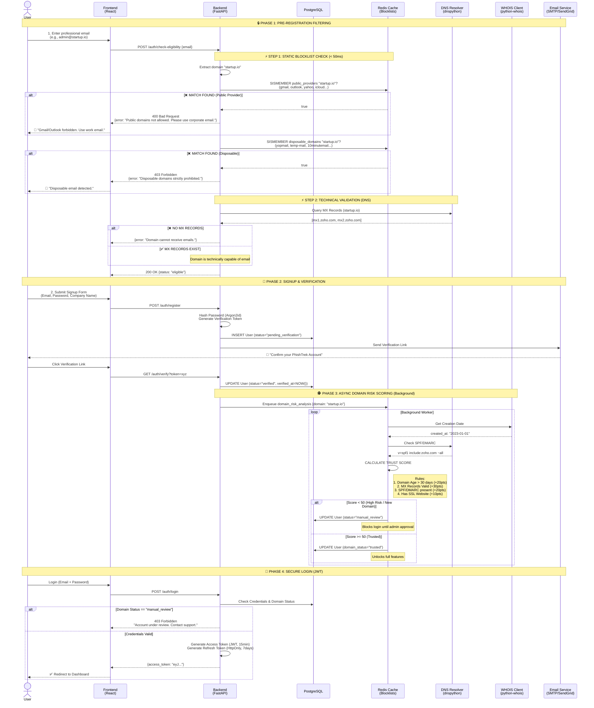

# PhishTrek - Authentication & Domain Validation System

## Secure Onboarding Flow with Professional Domain Validation

## 1\. Architecture Overview

Ce module assure que **seuls les professionnels légitimes** accèdent à PhishTrek. Contrairement à une application SaaS classique, nous gérons des outils offensifs (Phishing, Génération IA) ; il est donc impératif d'appliquer une politique **"Corporate Only"**.

### Objectifs de Sécurité

1.  **Anti-Abus :** Empêcher l'inscription avec des emails personnels ou jetables.
2.  **Validation Technique :** Vérifier que le domaine de l'entreprise existe réellement et est configuré pour recevoir des emails (MX Records).
3.  **Risk Scoring :** Détecter les domaines créés récemment (souvent utilisés par les attaquants) via WHOIS.
4.  **Credential Security :** Stockage des mots de passe conforme aux normes OWASP (Argon2id).

## 2\. Technical Stack

* **Backend Framework :** FastAPI (Python).
* **Authentication Library :** `FastAPI-Users` ou implémentation custom via `python-jose` (JWT) et `passlib` (Hashing).
* **Validation Libraries :**
    * `email-validator` : Syntaxe et délivrabilité basique.
    * `dnspython` : Résolution MX, SPF, DMARC.
    * `python-whois` : Récupération de l'âge du domaine.
* **Blocklists (Sources) :**
    * Listes open-source maintenues sur GitHub (ex: `disposable-email-domains`).
    * Chargées en mémoire (Redis ou Set Python) au démarrage de l'app pour une vérification en O(1).

## 3\. Detailed Validation Logic

### 3.1 Static Filtering (The Gatekeeper)

Avant même de toucher la base de données, l'API vérifie le domaine de l'email contre deux listes noires :

1.  **Public Providers :** `gmail.com`, `outlook.com`, `yahoo.fr`, `orange.fr`, etc.
2.  **Disposable Domains :** `yopmail.com`, `temp-mail.org`, `guerrillamail.com`, etc.

*Implémentation :* Un fichier `forbidden_domains.txt` chargé dans un `set()` Python pour une recherche instantanée.

### 3.2 DNS Deep Check

Si le domaine passe le filtre statique, nous interrogeons les serveurs DNS réels.

* **Check MX :** `NXDOMAIN` ou liste MX vide = Rejet immédiat. (L'entreprise ne peut pas recevoir d'emails, donc impossible de vérifier le compte).
* **Check SPF/DMARC :** La présence de ces enregistrements augmente le "Trust Score" car elle indique une configuration mail professionnelle.

### 3.3 Domain Age (The Anti-Attacker Check)

Les attaquants achètent souvent des domaines frais (il y a moins de 24h) pour lancer des campagnes.

* **Logique :** Si `(Current Date - Creation Date) < 30 jours`, le compte est flaggé en `manual_review`.
* **Outil :** Parsing WHOIS.

## 4\. Authentication Flow

### 4.1 Registration

1.  User soumet email/password.
2.  Validation Domaine (Étapes 3.1 & 3.2).
3.  Création User en base avec `is_active=False`.
4.  Envoi d'un email avec lien de confirmation (Token signé).

### 4.2 Login

1.  User soumet email/password.
2.  Backend vérifie hash (Argon2).
3.  Backend vérifie `is_active=True` ET `domain_status != blocked`.
4.  Émission d'un **Access Token (JWT)** courte durée (15-30 min) pour les requêtes API.
5.  Émission d'un **Refresh Token** (Cookie HttpOnly) longue durée (7 jours) pour maintenir la session.

## 5\. Feasibility & Constraints (Projet Étudiant)

| Contrainte                 | Solution Technique                                                                                                                                                                        |
|:---------------------------|:------------------------------------------------------------------------------------------------------------------------------------------------------------------------------------------|
| **API Whois Payante**      | Utiliser la librairie `python-whois` qui wrappe la commande système Linux `whois` (Gratuit, un peu plus lent mais OK pour un MVP).                                                        |
| **Maintenance des listes** | Créer un script simple qui `curl` périodiquement une liste GitHub publique de domaines jetables pour mettre à jour le fichier local.                                                      |
| **Faux Positifs**          | Si un domaine légitime est bloqué (ex: petite PME sans site web), prévoir une entrée manuelle en base de données par l'admin (`INSERT INTO allowed_domains...`) pour bypasser les checks. |