# PhishTrek - Campaign Orchestration Module

## Architecture d'Orchestration & Intégration GoPhish

Ce document détaille l'implémentation technique du module d'orchestration. Il s'appuie sur le code développé (FastAPI Wrapper + Frontend Modules) pour piloter l'outil open-source GoPhish via son API Admin.

```mermaid
sequenceDiagram
    actor RedTeam as Red Team / AI
    participant Frontend as React Frontend<br/>(CampaignsManager)
    participant API as FastAPI Backend<br/>(Orchestrator)
    participant Wrapper as GoPhish Wrapper<br/>(Isolation Layer)
    participant GoPhish as GoPhish Core<br/>(Docker Container)
    participant Target as Target User

    Note over RedTeam,Target: 🚀 PHASE 1: PREPARATION DES RESSOURCES

    RedTeam->>Frontend: 1. Create Target Group (CSV/Manual)
    Frontend->>API: POST /api/groups
    API->>Wrapper: create_group()
    Wrapper->>GoPhish: POST /api/groups/
    GoPhish-->>Wrapper: {id: 10, name: "Finance Team"}
    Wrapper-->>API: Group Created

    RedTeam->>Frontend: 2. Import Template (GenAI or Raw)
    Frontend->>API: POST /api/templates/import
    API->>Wrapper: import_email()
    Wrapper->>GoPhish: POST /api/import/email
    GoPhish-->>Wrapper: {html: "..."}
    Wrapper->>GoPhish: POST /api/templates/
    GoPhish-->>Wrapper: {id: 55, name: "AI_Audit_Template"}

    RedTeam->>Frontend: 3. Clone Landing Page
    Frontend->>API: POST /api/import/site {url: "login.microsoft.com"}
    API->>Wrapper: clone_site()
    Wrapper->>GoPhish: POST /api/import/site
    GoPhish-->>Wrapper: {html: "<form>..."}
    Wrapper->>GoPhish: POST /api/pages/
    GoPhish-->>Wrapper: {id: 22, name: "Cloned Microsoft"}

    Note over RedTeam,Target: 🚀 PHASE 2: LANCEMENT DE CAMPAGNE

    RedTeam->>Frontend: 4. Launch Campaign
    Frontend->>API: POST /api/campaigns
    
    API->>Wrapper: create_campaign(name, template_id=55, page_id=22...)
    
    Note right of Wrapper: Mapping IDs internes <-> GoPhish
    
    Wrapper->>GoPhish: POST /api/campaigns/
    GoPhish-->>Wrapper: {id: 100, status: "In Progress"}
    
    API-->>Frontend: 200 OK {id: 100, status: "Launched"}

    Note over GoPhish,Target: 📧 PHASE 3: EXECUTION (GoPhish Internal)

    GoPhish->>Target: Send Email via SMTP Profile
    Target->>GoPhish: Open Email (Tracking Pixel)
    Target->>GoPhish: Click Link
    Target->>GoPhish: Submit Credentials

    Note over Frontend,GoPhish: 📊 PHASE 4: MONITORING TEMPS RÉEL (POLLING)

    loop Every 5-10 Seconds
        Frontend->>API: GET /api/campaigns/100/results
        API->>Wrapper: get_campaign_results(100)
        Wrapper->>GoPhish: GET /api/campaigns/100/results
        GoPhish-->>Wrapper: {results: [{email: "user@acme.com", status: "Submitted Data"}]}
        Wrapper-->>API: Parsed Results
        API-->>Frontend: JSON Data
        Frontend->>Frontend: Update Charts & Tables
    end
```



## 1\. Vue d'ensemble Technique

Le module repose sur une architecture **Wrapper Pattern**. Plutôt que de réécrire un moteur de phishing, nous encapsulons la complexité de l'API GoPhish (souvent capricieuse) derrière une API REST propre (FastAPI) documentée via Swagger.

### Stack Technique (Implémentée dans le POC)

* **Backend :** Python 3.11 + FastAPI.
* **Middleware :** `GoPhishWrapper` (fichier `gophish_wrapper.py`) utilisant `requests` avec gestion de session persistante.
* **Validation :** Pydantic (`models.py`) pour garantir que les données envoyées à GoPhish sont strictement typées.
* **Frontend :** JS Vanilla modulaire (`modules/campaigns.js`, `modules/pages.js`) avec Chart.js pour la viz.

## 2\. Fonctionnalités Clés Implémentées

### 2.1 Gestion des Groupes & Cibles (`groups.js`)

* **Import CSV intelligent :** Le backend utilise `csv.Sniffer` pour détecter automatiquement le format (virgule, point-virgule) et mapper les colonnes (`email`, `firstname`, `position`).
* **Mode Manuel :** Ajout dynamique de lignes dans l'interface pour des tests rapides.

### 2.2 Moteur de Templates & GenAI (`templates.js`)

* **Import Raw Email :** Capacité de coller le code source brut d'un email (RFC 2045). Le wrapper nettoie le code et convertit automatiquement les liens en traceurs `{{.URL}}`.
* **Visual Editor :** Toggle entre code source HTML et prévisualisation visuelle.
* **Intégration future GenAI :** L'architecture est prête pour que le module 02 injecte directement le JSON dans l'endpoint `/api/templates`.

### 2.3 Site Cloner (`pages.js`)

* **Proxy GoPhish :** Utilise l'endpoint natif `/api/import/site` de GoPhish pour cloner n'importe quelle page de login (Microsoft, Google, LinkedIn).
* **Injection JS :** GoPhish injecte automatiquement les scripts de capture de credentials.
* **Nettoyage HTML :** Le frontend inclut une fonction `cleanGoPhishTemplates()` pour éviter que les accolades `{{ }}` du site cloné (ex: React/Vue) ne fassent planter le moteur de template Go (GoPhish).

### 2.4 Orchestration de Campagne (`campaigns.js`)

* **Assemblage :** La création d'une campagne est un assemblage d'IDs : `Template ID` + `Page ID` + `SMTP ID` + `Group ID`.
* **Scheduling :** Support du lancement différé (`launch_date`).

## 3\. Stratégie de Monitoring (Real-Time)

Contrairement à une approche WebSockets complexe, le POC utilise une stratégie de **Polling Optimisé** qui est robuste et simple à déployer :

1.  **Vue Liste (`Dashboard`) :**

    * Appel : `GET /api/campaigns/summary`
    * Fréquence : Toutes les **15 secondes**.
    * Données : Statuts uniquement (En cours, Terminé) pour les compteurs globaux.

2.  **Vue Détail (`Campaign Details`) :**

    * Appel : `GET /api/campaigns/{id}/results`
    * Fréquence : Toutes les **5 secondes**.
    * Données : Liste complète des événements (Email Sent, Opened, Clicked, Submitted).
    * **Visualisation :** Mise à jour dynamique des graphiques `Doughnut` (Chart.js) et de la Timeline sans rechargement de page.

## 4\. Sécurité & Configuration (`config.py`)

* **API Key Management :** La clé API GoPhish est chargée via `.env` et n'est jamais exposée au frontend.
* **SSL Verification :** Variable `GOPHISH_VERIFY_SSL=False` pour supporter les certificats auto-signés de GoPhish en environnement de dev (Docker).
* **CORS :** Le backend FastAPI filtre les origines autorisées pour empêcher les appels cross-site non autorisés.

## 5\. Guide de Déploiement (Docker)

Pour que l'orchestration fonctionne, les conteneurs doivent communiquer sur le réseau Docker interne.

```yaml
# docker-compose.yml (extrait)
services:
  gophish:
    image: gophish/gophish:latest
    ports:
      - "3333:3333" # Admin URL
      - "80:80"     # Phishing Server
    environment:
      - GOPHISH_HOST=0.0.0.0

  backend:
    build: ./backend
    environment:
      - GOPHISH_HOST=https://gophish:3333 # Communication interne Docker
      - GOPHISH_API_KEY=${GOPHISH_API_KEY}
    depends_on:
      - gophish
```

## 6\. Prochaines Étapes (Intégration)

1.  **Vers le Module 04 (Détection) :** Le backend devra stocker les résultats de `get_campaign_results` dans une base de données persistante (PostgreSQL) pour permettre l'analyse post-mortem (et ne pas dépendre de la DB SQLite de GoPhish).
2.  **Vers le Dashboard (Module 06) :** Les JSONs renvoyés par `/api/campaigns/{id}/results` contiennent exactement la structure nécessaire pour les KPIs (timeline, user-agent, IP).
