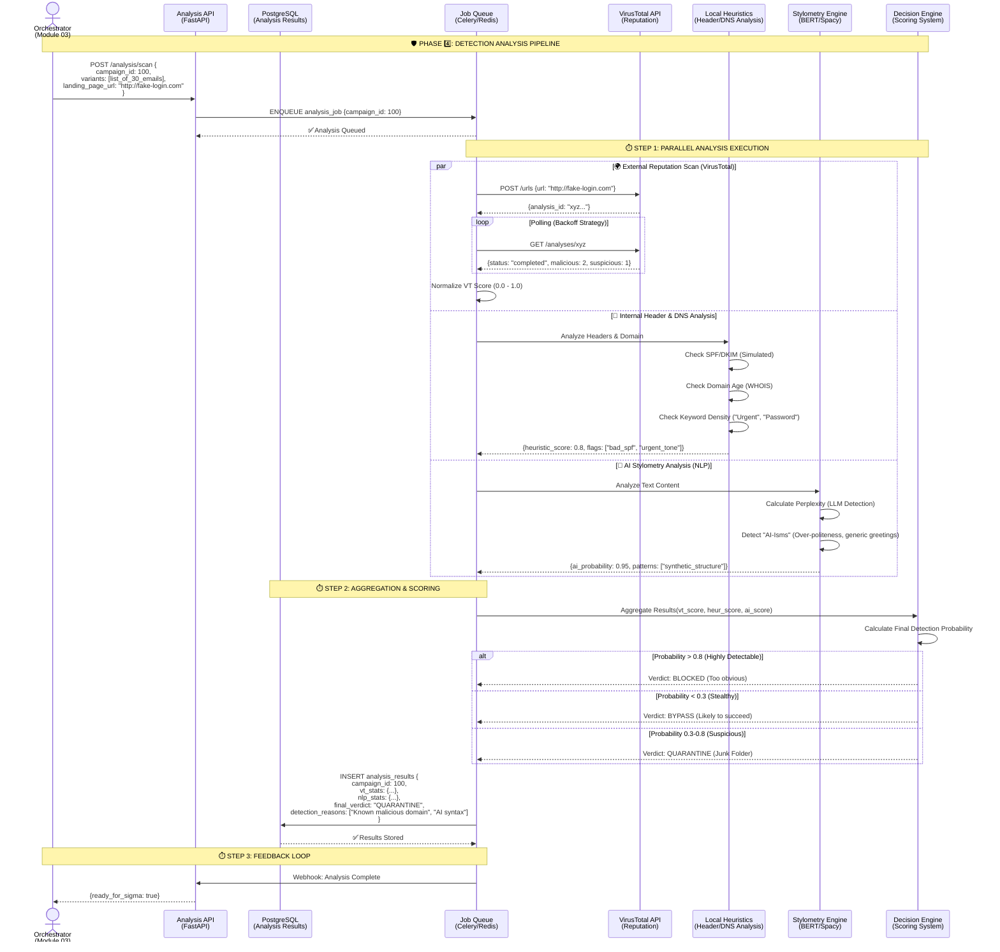

# PhishTrek - Detection & Analysis Pipeline

## Multi-Layer Defensive Analysis Architecture

Ce module est le cœur "Blue Team" de la plateforme. Il analyse les emails (templates) et les URLs générés pour déterminer s'ils seraient détectés par des solutions de sécurité réelles. Il combine l'analyse de réputation (VirusTotal) et l'analyse comportementale (NLP/Heuristique).



## 1\. Architecture Overview

Le **Detection Pipeline** ne se contente pas de dire "C'est un virus". Il quantifie le risque et explique *pourquoi* un email généré par notre IA (Module 02) pourrait être bloqué. C'est essentiel pour la boucle de rétroaction : si nos attaques sont tout le temps détectées, nous devons améliorer le générateur.

### Composants Clés

1.  **Scanner de Réputation (Externe) :** Interroge VirusTotal pour savoir si l'URL de phishing (landing page) est déjà connue des listes noires.
2.  **Moteur Heuristique (Interne) :** Simule le comportement d'une passerelle mail (IronPort, Proofpoint) en vérifiant les règles techniques (SPF, DMARC, Mots-clés interdits).
3.  **Détecteur d'IA (Stylométrie) :** Analyse le texte pour voir s'il "sonne" comme une IA (perplexité faible, structure trop parfaite).

## 2\. Technical Implementation Details

### 2.1 VirusTotal Integration (Optimized)

L'intégration VirusTotal doit gérer les quotas stricts de l'API gratuite (4 requêtes/minute).

* **Caching (Redis) :** Avant d'interroger VT, on vérifie si l'URL a été scannée il y a moins de 24h. Si oui, on renvoie le résultat du cache `vt:url:{hash}`.
* **Backoff Strategy :** Si le quota est atteint (`429 Too Many Requests`), le worker Celery se met en pause et réessaie avec un délai exponentiel (15s, 30s, 60s).

### 2.2 Local Heuristics Engine (Python)

Ce moteur est une série de règles Python pures (pas d'IA) pour la détection rapide.

```python
def calculate_heuristic_score(email_content, domain_info):
    score = 0
    flags = []
    
    # Règle 1 : Urgence
    if any(w in email_content.subject.lower() for w in ["urgent", "immédiat", "suspendu"]):
        score += 20
        flags.append("URGENCY_KEYWORD")
        
    # Règle 2 : Configuration DNS (Simulé pour le POC)
    if not domain_info.spf_record:
        score += 30
        flags.append("MISSING_SPF")
        
    # Règle 3 : Tracking Links
    if "click?r=" in email_content.body:
        score += 15
        flags.append("SUSPICIOUS_LINK_PATTERN")
        
    return score, flags
```

### 2.3 AI Stylometry Analysis (NLP)

Pour détecter si l'email a été écrit par une IA (Module 02), nous utilisons une approche simplifiée de calcul de "Perplexité" ou de détection de patterns.

* **Outil :** Librairie `transformers` (HuggingFace) ou API simple si ressources limitées.
* **Logique :** Les modèles LLM produisent des textes à "faible entropie" (très prévisibles).
* **Implémentation POC :** Utilisation d'un classifieur pré-entrainé léger (ex: `roberta-base-openai-detector`) chargé localement pour ne pas dépendre d'une API externe coûteuse.

## 3\. Data Model (PostgreSQL)

Les résultats sont stockés de manière structurée pour permettre la génération de règles Sigma (Module 05).

**Table: `analysis_results`**
| Column | Type | Description |
| :--- | :--- | :--- |
| `id` | UUID | Primary Key |
| `campaign_id` | Integer | Link to Campaign |
| `vt_json` | JSONB | Raw VirusTotal Response |
| `heuristics_json` | JSONB | Score & Flags (e.g., `{"score": 45, "flags": ["bad_spf"]}`) |
| `ai_score` | Float | 0.0 (Human) to 1.0 (AI) |
| `final_verdict` | String | CLEAN, SUSPICIOUS, MALICIOUS |
| `analyzed_at` | Timestamp | Date of analysis |

## 4\. Integration Points

* **Input :** Reçoit la liste des variants et l'URL depuis le Module **03\_GoPhish\_Orchestration**.
* **Output :** Met à disposition les résultats structurés pour le Module **05\_Automated\_Sigma\_Rule\_Generation**.

## 5\. Feasibility & Constraints (Projet Étudiant)

| Contrainte           | Solution Technique                                                                                                                                                               |
|:---------------------|:---------------------------------------------------------------------------------------------------------------------------------------------------------------------------------|
| **Quota VirusTotal** | Le cache Redis est obligatoire. De plus, on ne scanne que l'URL unique de la landing page, pas les 30 emails (qui contiennent tous la même URL).                                 |
| **Complexité NLP**   | Ne pas entraîner un modèle de zéro. Utiliser un modèle "Zero-Shot" ou un modèle de détection existant sur HuggingFace (gratuit).                                                 |
| **Faux Positifs**    | Le système doit permettre à l'utilisateur de marquer un résultat comme "Faux Positif" dans le Dashboard pour ajuster le score (ex: ignorer le flag SPF si on est en test local). |
