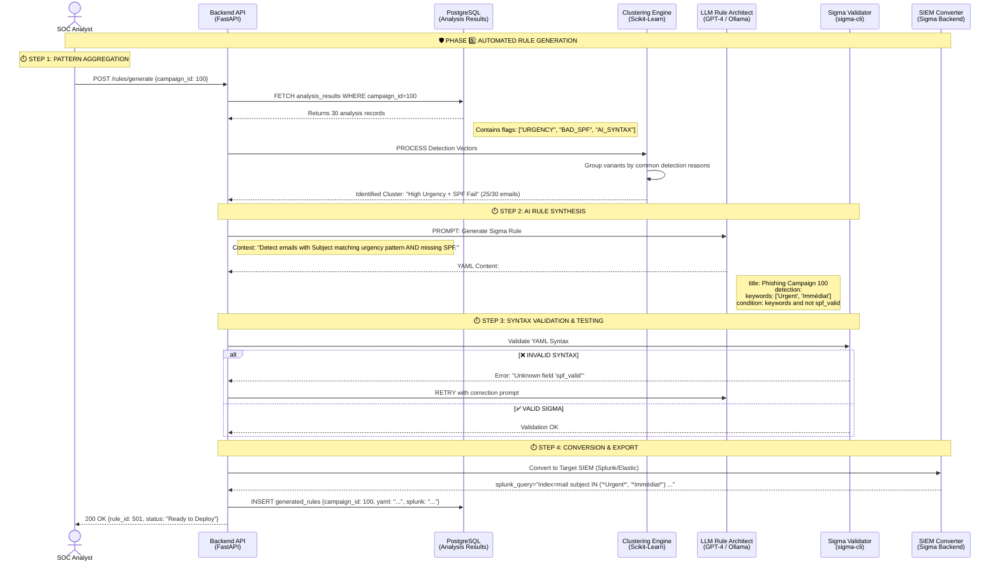

# PhishTrek - Automated Sigma Rule Generation

## AI-Driven Defense Engineering Module

Ce module ferme la boucle "Red Team → Blue Team". Il analyse les caractéristiques des emails générés (Module 02) et les résultats de leur détection (Module 04) pour créer, valider et exporter automatiquement des règles de détection au format standard **Sigma**.



## 1\. Architecture Overview

Ce module n'est pas un simple "exportateur". C'est un moteur d'ingénierie qui traduit des signaux faibles en règles fortes.

### Objectifs Techniques

1.  **Clustering Intelligent :** Si une campagne a 30 variantes, on ne veut pas 30 règles. On veut **1 règle générique** qui couvre les 30 variantes. Le moteur doit donc identifier le "Plus Petit Dénominateur Commun" (ex: tous les emails malveillants proviennent d'un domaine sans SPF).
2.  **Standardisation Sigma :** Utiliser le format Sigma permet d'être agnostique du SIEM (compatible Splunk, ELK, QRadar, Microsoft Sentinel).
3.  **Validation Syntaxique :** Garantir que le YAML généré par l'IA est valide avant de le proposer à l'humain.

## 2\. Technical Implementation Details

### 2.1 The Clustering Engine (Python)

Avant d'appeler l'IA, nous devons structurer les données.
Nous utilisons une logique d'agrégation basée sur les `flags` retournés par le Module 04.

* **Input :** Liste de 30 JSONs d'analyse.
* **Logique :** Compter la fréquence des flags.
    * Si `MISSING_SPF` apparaît dans 100% des emails -\> C'est un critère fort.
    * Si `URGENCY_KEYWORD` apparaît dans 80% -\> C'est un critère secondaire.
    * Si `AI_SYNTAX` apparaît dans 90% -\> C'est un critère contextuel.

### 2.2 LLM Prompt Engineering (The "Rule Architect")

Le prompt système est conçu pour forcer le LLM à agir comme un ingénieur de détection.

**Exemple de Prompt :**

```text
ROLE: You are a Sigma Rule Engineer.
TASK: Create a detection rule for a specific phishing campaign.

INPUT DATA:
- Pattern 1: Email Subject contains ["Urgent", "Action Requise"] (Frequency: 100%)
- Pattern 2: Sender Domain has no SPF record (Frequency: 100%)
- Pattern 3: Body contains "verify-account.com" (Frequency: 100%)

REQUIREMENTS:
1. Output ONLY valid YAML.
2. Use standard logsource: category=email, product=mta.
3. Level: High.
4. Title: "PhishTrek Campaign Detection [Auto-Generated]"

OUTPUT FORMAT:
(Sigma YAML content only)
```

### 2.3 Validation Pipeline (`sigma-cli`)

Pour le projet étudiant, nous pouvons utiliser la librairie Python `pysigma` ou wrapper l'outil CLI officiel `sigma-cli` dans le conteneur Docker.

```python
# Exemple de validation simplifiée en Python
import yaml

def validate_rule(yaml_content):
    try:
        rule = yaml.safe_load(yaml_content)
        required_fields = ['title', 'logsource', 'detection', 'condition']
        if not all(field in rule for field in required_fields):
            return False, "Missing required fields"
        return True, "OK"
    except yaml.YAMLError as e:
        return False, str(e)
```

## 3\. Data Model (PostgreSQL)

**Table: `sigma_rules`**
| Column | Type | Description |
| :--- | :--- | :--- |
| `id` | UUID | Primary Key |
| `campaign_id` | Integer | Source Campaign |
| `rule_yaml` | Text | The raw Sigma rule |
| `target_siem` | Varchar | "splunk", "elastic", "all" |
| `converted_query` | Text | The executable query (e.g., SPL) |
| `coverage_score` | Float | % of campaign variants detected by this rule |
| `created_at` | Timestamp | Creation date |

## 4\. Integration Points

* **Input (Upstream) :** Lit les résultats consolidés dans la table `analysis_results` (peuplée par le Module 04).
* **Output (Downstream) :** Rend les règles disponibles pour le **Module 06 (Dashboard)** où l'utilisateur pourra les télécharger ou les copier-coller.

## 5\. Feasibility & Constraints (Projet Étudiant)

| Contrainte             | Solution Technique                                                                                                                                                                                                              |
|:-----------------------|:--------------------------------------------------------------------------------------------------------------------------------------------------------------------------------------------------------------------------------|
| **Complexité SIEM**    | Ne pas essayer de se connecter directement à un Splunk réel via API pour le MVP. Se contenter de **générer la requête texte** (SPL/KQL) que l'utilisateur peut copier. C'est suffisant pour valider la compétence "Ingénierie". |
| **Hallucination LLM**  | Le LLM peut inventer des champs Sigma qui n'existent pas. La validation syntaxique (`validate_rule`) est un "Quality Gate" obligatoire avant l'enregistrement en base.                                                          |
| **Qualité des Règles** | Les règles générées automatiquement sont souvent "bruyantes" (Faux Positifs). Ajouter un champ `status: experimental` dans le YAML généré pour montrer au jury que vous comprenez les bonnes pratiques SOC.                     |
