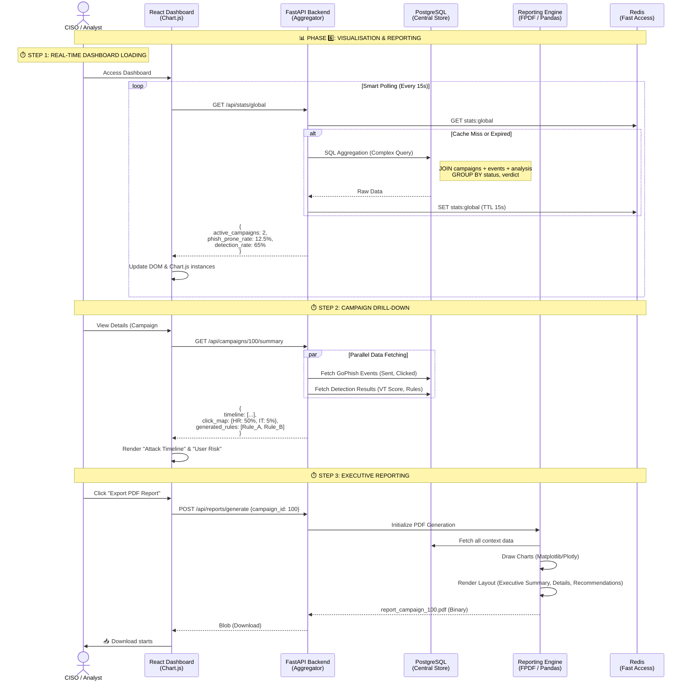

# PhishTrek - Analytics & Reporting Module

## KPI Aggregation & CISO Dashboarding

Ce module est la couche de présentation et d'intelligence décisionnelle. Il agrège les données provenant des opérations offensives (Module 03) et des analyses défensives (Module 04/05) pour fournir une vue unifiée de la posture de sécurité.



## 1\. Architecture Overview

Le module de Dashboard ne stocke pas de nouvelles données, il les **transforme**. Son rôle est de calculer des métriques de haut niveau ("Metris") à partir des logs bruts ("Logs").

### Objectifs Techniques

1.  **Performance de Lecture :** Les tableaux de bord doivent charger en \< 1s, même avec des milliers d'événements. Utilisation de **Redis** pour mettre en cache les requêtes SQL d'agrégation lourdes.
2.  **Visualisation Interactive :** Utilisation de **Chart.js** (déjà intégré dans le PoC) pour rendre les données digestes (Donuts, Timelines).
3.  **Reporting Statique :** Capacité à figer l'état d'une campagne dans un rapport PDF formel pour la direction ou l'audit.

## 2\. Technical Stack (Alignée PoC)

* **Frontend Viz :** `Chart.js` v3 (Léger, Canvas-based, parfait pour le web).
* **Backend Utils :** `Pandas` (pour manipuler les séries temporelles de données) + `FPDF` ou `WeasyPrint` (pour la génération PDF côté serveur).
* **Data Aggregation :** SQL natif optimisé (PostgreSQL) via SQLAlchemy.

## 3\. Key Performance Indicators (KPIs)

Le dashboard calcule et affiche 4 catégories de métriques :

### A. Métriques Offensives (GoPhish Data)

* **Taux d'Ouverture :** `(Email Opened / Email Sent) * 100`
* **Phish-Prone Percentage (PPP) :** `(Clicked Link + Submitted Data) / Email Sent`. C'est le KPI roi pour mesurer la vulnérabilité humaine.
* **Time-to-Click :** Temps médian entre l'envoi et le premier clic (indique l'impulsivité des cibles).

### B. Métriques Défensives (PhishTrek Intelligence)

* **Detection Gap :** Différence entre ce qui est bloqué par VT et ce qui passe.
* **Rule Coverage :** Pourcentage de variants couverts par au moins une règle Sigma générée (Module 05).

### C. Risque Organisationnel

* **Top Risky Departments :** Agrégation des clics par groupe/département (ex: Finance vs IT).
* **Repeat Offenders :** Utilisateurs ayant cliqué sur plusieurs campagnes différentes.

## 4\. Implementation Details

### 4.1 Smart Polling Strategy (Frontend)

Comme vu dans `js/modules/campaigns.js`, nous n'utilisons pas de WebSockets complexes pour le MVP, mais un polling adaptatif :

* **Vue Liste :** Refresh toutes les 15s (Charge faible).
* **Vue Détail (Active) :** Refresh toutes les 5s (Pour voir les clics arriver en "temps réel").
* **Background :** Si l'onglet est inactif, le polling s'arrête (économie de ressources).

### 4.2 Report Generation Engine (Backend)

La génération de PDF se fait à la volée en Python :

1.  Récupération des données brutes en JSON.
2.  Génération des graphiques statiques (PNG) via `matplotlib` (en backend, invisible pour l'user).
3.  Assemblage du PDF : Page de garde -\> Sommaire -\> Stats -\> Graphiques -\> Recommandations (Règles Sigma).

## 5\. Data Model & Aggregation

Les vues SQL (ou requêtes complexes) sont essentielles ici pour éviter de faire les calculs en Python (trop lent).

```sql
-- Exemple de requête pour le "Phish-Prone Percentage" par département
SELECT 
    target_group,
    COUNT(CASE WHEN event = 'clicked' THEN 1 END) * 100.0 / COUNT(*) as risk_score
FROM campaign_events
GROUP BY target_group
ORDER BY risk_score DESC;
```

## 6\. Integration Points

* **Upstream :** Lit toutes les tables : `campaign_events` (03), `analysis_results` (04), `sigma_rules` (05).
* **Output :** PDF Reports, CSV Exports.

## 7\. Feasibility & Constraints

| Contrainte            | Solution Technique                                                                                                     |
|:----------------------|:-----------------------------------------------------------------------------------------------------------------------|
| **Performance SQL**   | Si la table `events` dépasse 100k lignes, créer des **Materialized Views** dans PostgreSQL rafraîchies périodiquement. |
| **Génération PDF**    | Générer du PDF en HTML/CSS via `WeasyPrint` est plus simple que de dessiner pixel par pixel.                           |
| **Cohérence Données** | Gérer le cas où GoPhish supprime une campagne mais les logs restent dans PhishTrek (Soft Delete).                      |
